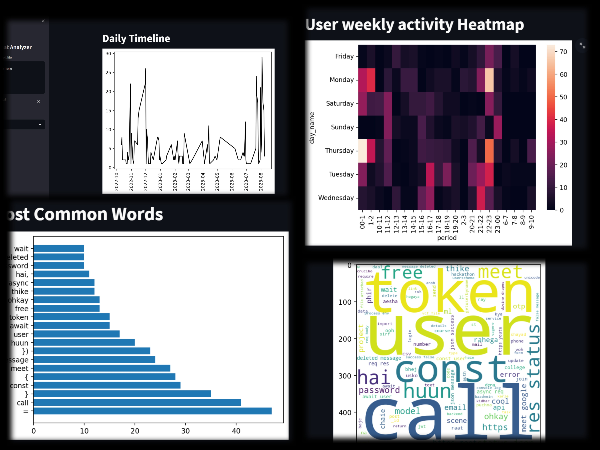

# Whatsapp-Chat-Analysis
DEMO: [WhatsApp Chat Analyzer](https://whatsapp-chat-analyzer-7bgr.onrender.com)

NOTE: Enter .txt file in 24 hr Format

Description
Welcome to the WhatsApp Chat Analysis project! This repository contains Python code designed to analyze and extract insights from WhatsApp chat messages. If you've ever wondered about the patterns, trends, and sentiment within your WhatsApp conversations, this project provides a set of tools to help you do just that.

#What does it do?
This analysis script takes your WhatsApp chat export, usually in text format, and processes it to reveal various interesting aspects of the conversation. Some of the features and insights it offers include:

Word Frequency Analysis: Discover which words are most commonly used by participants in the chat.
Activity Timelines: Visualize the activity levels of participants over time, helping to identify when the chat is most active.
Most Active Users: Identify the participants who contribute the most to the conversation.
Sentiment Analysis: If you have textual data, you can also perform sentiment analysis to gauge the emotional tone of the conversation.

#Why use it?
Personal Insights: Gain a deeper understanding of your chats. Who talks the most? What are the most common words? When is the chat most active?
Social Analysis: Analyze group chats, study group dynamics, or even analyze public chat data (with privacy considerations).
Whether you're curious about your own chats or want to delve into the dynamics of larger conversations, this WhatsApp Chat Analysis project provides a valuable toolkit for extracting meaningful insights.

Feel free to adapt and modify this description to match the specifics of your project. The goal is to clearly explain what your project does, why someone might want to use it, and how they can get started.

This tool can be useful for identifying topics discussed during a meeting, or even just getting an overview

## Screenshots
Here are some screenshots of the project in action:

*Word Frequency Analysis*

*Activity Timelines*